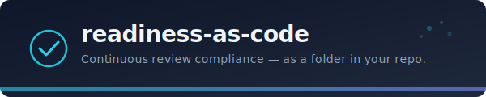

<p align="center">
  
</p>

<h3 align="center">
  AI tools made your team faster. They didn't make your team safer.
</h3>

<p align="center">
  <strong>ready</strong> is the discipline layer that keeps pace with AI velocity —<br/>
  review criteria as committed definitions, evaluated on every change,<br/>
  with drift detected automatically before it becomes an incident.
</p>

<p align="center">
  No infrastructure. No SaaS. No subscription.<br/>
  JSON definitions + Python scanner + CI template.
</p>

<p align="center">
  <a href="#quickstart">Quickstart</a> •
  <a href="docs/getting-started.md">Docs</a> •
  <a href="docs/architecture-and-tradeoffs.md">Architecture</a> •
  <a href="docs/verification-types.md">Verification Types</a> •
  <a href="docs/ci-integration.md">CI Integration</a>
</p>

<p align="center">
  <a href=".readiness/review-baseline.json">
    
  </a>
  
</p>

---

## Connect with Jeremiah Walters

[](https://www.linkedin.com/in/jeremiahwalters)
[](https://x.com/Afrotechnician)

## The Problem: Velocity Outran Discipline

AI coding tools removed the friction from writing and shipping code. They did not remove the friction from the discipline work — health checks, secrets hygiene, on-call registration, telemetry coverage, auth on every endpoint. Velocity is now AI-speed. Discipline is still person-speed. The gap between the two is where incidents live.

Production breakdowns keep hitting strong engineering orgs — not because they lack talent, but because velocity outran the scaffolding. Smart teams moved fast, skipped the prep work, and found out later that the checks weren't there. `ready` is the tool that implements this practice. It replaces **prep work**, not judgment.

## Before / After

| Before | After |
|--------|-------|
| AI writes code in seconds; readiness checks take hours | Readiness checks run in the same pipeline, same pace |
| Manual checklists that can't keep up with AI velocity | Automated scan on every PR — no human bottleneck |
| Point-in-time review ceremonies | Continuous compliance, not a quarterly ritual |
| Drift detected by incidents | Drift detected before merge |
| Tribal knowledge of what's missing | Structured gap list with file-path evidence |
| "Are we ready?" is a subjective question | "Are we ready?" has a deterministic answer |
| Accepted risks forgotten over time | Accepted risks expire and re-surface automatically |

## Quickstart

```bash
pip install readiness-as-code

cd your-repo
ready scan
```

> **Windows / PATH issues?** Use `python -m ready scan` — works anywhere Python is installed.

```
ready? — your-service   80%   1 blocking · 2 warnings

  ✗ No secrets in code
    src/config.py:14
    → Remove hardcoded keys. Use environment variables or a secrets manager.

  + 2 warnings   (ready scan --verbose)
```

**No config. No accounts. No init required.** `ready scan` auto-detects your project type and runs immediately. When you're ready to customize, run `ready init`.

When everything is passing:

```
ready? — your-service   100%   ✓   ▲ +12%
```

One line. The drift indicator appears automatically whenever a committed baseline exists.

## Origin

Built from production use managing 86+ readiness checkpoints across enterprise reliability engineering at scale. This is the vendor-neutral, portable version of a system that enforces production readiness across real services handling real incidents — not a weekend experiment.

## How It Works

```
your-repo/
└── .readiness/
    ├── checkpoint-definitions.json   # What to check
    ├── exceptions.json               # Accepted risks + expiry
    ├── external-evidence.json        # Human attestations for non-code artifacts
    └── review-baseline.json          # Last scan snapshot (committed = audit trail)
```

Four JSON files and a scanner. Checkpoints resolve through three verification types: **code checks** (grep/glob/file_exists against the repo), **external checks** (human attestations for artifacts outside the repo), and **hybrid checks** (both must pass). → [Architecture details](docs/architecture-and-tradeoffs.md) · [Verification types](docs/verification-types.md)

## Checkpoint Packs

Start with a curated pack, then customize:

```bash
ready init                                   # Universal starter (default)
ready init --pack web-api                    # REST/HTTP API checks
ready init --pack security-baseline          # Secrets, dependency hygiene, security policy
ready init --pack telemetry                  # Logging, tracing, metrics, dashboards
ready init --pack engineering-review         # Full engineering review (arch, security, testing, AI/RAI)
ready init --pack operational-review         # Operational readiness (SLOs, on-call, data, capacity)
ready init --pack governance                 # SDLC gates + external review attestations
ready init --pack service-migration          # Service identity migration, auth provisioning, cutover
ready init --list-packs                      # Show all available packs
```

| Pack | Checks | Best for |
|------|--------|----------|
| `starter` | 11 | Any repo |
| `web-api` | 17 | REST/HTTP services |
| `security-baseline` | 8 | Any repo with sensitive data |
| `telemetry` | 8 | Production services |
| `engineering-review` | 26 | Pre-launch engineering review |
| `operational-review` | 14 | Pre-launch operational review |
| `governance` | 15 | SDLC compliance + sign-off tracking |
| `service-migration` | 9 | Service identity migration + cutover |

## Proven in Production

ready is based on a system used in enterprise reliability engineering environments, 
enforcing 80+ readiness checkpoints across real services.

It has been used to:
- continuously evaluate production readiness across services
- detect regression before deployment
- reduce reliance on manual review preparation

This open-source version is the portable, vendor-neutral implementation.

## Detection Accuracy

Checkpoint packs are continuously tested against real-world repository structures to eliminate false negatives and false positives. Results from our benchmark suite against a representative cloud service repo:

### Engineering Review Pack

| Checkpoint | Before | After | Issue Fixed |
|---|---|---|---|
| eng-sec-03 Input validation | fail | **pass** | Nested dirs (`src/app/validators/`) now detected |
| eng-sec-06 SDL gates in CI | fail | **pass** | Microsoft tooling (PoliCheck, BinSkim, Roslyn) recognized |
| eng-sec-08 Hardcoded secrets | fail | **pass** | Test fixtures excluded via `exclude_paths` |
| eng-doc-04 OpenAPI spec | fail | **pass** | `docs/openapi.yaml` pattern added |

**Readiness score: 20% &rarr; 36% (+16%)** on the same repo, same code.

### Operational Review Pack

| Checkpoint | Before | After | Issue Fixed |
|---|---|---|---|
| ops-oncall-02 Post-mortem template | fail | **pass** | `POST_MORTEM_TEMPLATE.md` case variant detected |
| ops-data-02 Failure modes | fail | **pass** | `failure_modes.md` underscore variant detected |

**Readiness score: 64% &rarr; 79% (+14%)** on the same repo, same code.

### False Positive Reduction

Secrets detection (`eng-sec-08`) previously flagged test fixtures as real secrets:

```
BEFORE: fail — 2 false positives
  tests/test_auth.py:2  mock_token = "fake-token-1234567890"
  tests/test_auth.py:3  api_key = "test-api-key-for-unit-tests"

AFTER: pass — 0 false positives
  Test directories excluded. Production code still scanned.
```

## Key Capabilities

- **Auto-drift detection.** If a committed baseline exists, every scan shows a delta: `▲ +12%` or `▼ -5%`. No flags, no extra commands.
- **Closed-loop work item tracking.** Gaps become tracked work items (GitHub, Azure DevOps, Jira); ticket-closed-but-code-failing flags as **regression**, code-fixed-but-ticket-open as **stale**.
- **Cross-repo aggregation.** `ready aggregate` turns multiple baselines into an HTML heatmap — *"telemetry gaps in 4 of 5 services"* is a platform problem, not a team problem.
- **Expiring accepted risks.** Acknowledge a gap with a justification and expiry date; the scanner re-flags it when the expiry passes.
- **HTML dashboard.** `ready dashboard` generates a self-contained HTML dashboard — score ring, sparkline trajectory, blocking gaps, flapping checks, MTTR leaderboard. One file, no dependencies, dark theme.
- **Readiness audit.** `ready audit` reports the health of the readiness system itself — exception age, definition staleness, review_by coverage, score trend.
- **AI-tool remediation context.** `ready scan --fix-context` outputs structured remediation prompts for every failing check — pipe directly to `claude`, `gh copilot suggest`, or any LLM. The scanner provides the context, your AI tool writes the fix.
- **Codebase-aware inference.** `ready infer` analyzes stack, frameworks, dependencies, ADRs, and auth patterns to propose tailored checkpoints you approve one at a time.
- **AI-assisted authoring.** `ready author --from guidelines.md` generates a paste-ready prompt for any model (Claude, ChatGPT, Copilot, Cursor, Gemini).
- **README badge.** `ready badge` generates a shields.io badge from the committed score.
- **CI gating.** Non-zero exit on red failures; templates for GitHub Actions, Azure Pipelines, GitLab CI. → [Details](docs/ci-integration.md)
- **Azure DevOps extension.** Pipeline task publishes each checkpoint as a test case, plus a dashboard widget for score, trend, and blocking count. → [Details](ado-extension/README.md)

## What This Is Not

- **Not a static analysis tool.** SonarQube checks code quality. This checks whether your service meets its review requirements.
- **Not a policy engine.** OPA/Sentinel enforce infra policies at deploy time. This tracks operational and engineering readiness across code and non-code artifacts.
- **Not a compliance SaaS.** Drata/RegScale automate regulatory frameworks. This enforces your team's own internal review standards.
- **Not a replacement for AI coding tools.** It's the complement to them — the discipline layer that keeps pace with the velocity they enable.
- **Not a replacement for review meetings.** This replaces the prep work so the meeting can focus on judgment calls the scanner can't make.

## Commands

```bash
# Scanning
ready scan                             # Score + blocking items
ready scan --verbose                   # Full detail — all checks, evidence, fix hints
ready scan --calibrate                 # Report-only (no exit code failure)
ready scan --json                      # Machine-readable output
ready scan --baseline FILE             # Write baseline snapshot (enables drift tracking)
ready scan --suggest-tuning            # Show pattern tuning suggestions after scan
ready scan --fix-context               # Output remediation context for AI tools
ready scan --fix-context | claude      # Pipe to Claude CLI for auto-fix
ready scan --fix-context --checkpoint ID  # Fix context for one checkpoint

# Setup
ready init                             # Scaffold .readiness/ with starter pack
ready init --pack web-api              # Scaffold with a specific pack
ready init --list-packs                # List available packs

# Authoring & inference
ready infer                            # Analyze codebase → propose tailored checkpoints (human approves each)
ready author --from FILE               # Generate AI prompt from a guideline document

# Audit trail
ready badge                            # Generate README badge from current score
ready decisions                        # Show all active, expiring, and expired exceptions
ready history [BASELINES...]           # Show readiness trend from baseline snapshots
ready audit                            # Audit exception health, definition staleness, and score health

# Work items
ready items --create                   # Propose + create work items (human approves each)
ready items --verify                   # Cross-check work items vs code
ready items --verify --auto-reopen     # Reopen closed items for regressions
ready items --verify --dry-run         # Preview without API calls

# Analytics & observability
ready trends                           # Score timeline from scan history
ready trends --last 50                 # Show last 50 scans
ready health                           # Chronic failures, flapping, MTTR analysis
ready dashboard                        # Self-contained HTML readiness dashboard
ready dashboard --open                 # Generate and open in browser
ready watch                            # Watch for changes and re-scan continuously
ready watch --interval 5               # Custom poll interval (seconds)

# Cross-repo
ready aggregate PATHS...               # Cross-repo heatmap from multiple baselines
ready aggregate PATHS... --html        # Generate self-contained HTML heatmap report
```

## GitHub Action

Add readiness gating to any repo with one step:

```yaml
# .github/workflows/readiness.yml
name: Readiness Check
on: [pull_request]

jobs:
  readiness:
    runs-on: ubuntu-latest
    steps:
      - uses: actions/checkout@v4
      - uses: jtwalters25/readiness-as-code@v0.7.1
```

On pull requests, the action automatically posts a **PR comment** with the readiness score, blocking count, and pass/fail status — updated on each push.

With options:

```yaml
      - uses: jtwalters25/readiness-as-code@v0.7.1
        with:
          pack: web-api               # auto-init with a checkpoint pack
          fail-on-red: "true"         # fail the build on blocking gaps
          baseline: .readiness/baseline.json
          markdown: .readiness/gaps.md
          fix-context: .readiness/fix-context.md   # AI remediation context artifact
          dashboard: .readiness/dashboard.html     # HTML dashboard artifact
```

Outputs are available for downstream steps:

```yaml
      - uses: jtwalters25/readiness-as-code@v0.7.1
        id: ready
      - run: echo "Readiness: ${{ steps.ready.outputs.readiness-pct }}%"
```

| Input | Description | Default |
|-------|-------------|---------|
| `pack` | Checkpoint pack to auto-init with | |
| `fail-on-red` | Fail the build on blocking gaps | `"true"` |
| `baseline` | Write baseline snapshot for drift tracking | |
| `markdown` | Write markdown gaps checklist | |
| `fix-context` | Generate AI remediation context (pipe to Claude/Copilot) | |
| `dashboard` | Generate self-contained HTML dashboard | |
| `args` | Additional `ready scan` arguments | |

| Output | Description |
|--------|-------------|
| `readiness-pct` | Readiness percentage (0-100) |
| `failing-red` | Number of blocking failures |
| `failing-yellow` | Number of warnings |
| `passing` | Number of passing checks |
| `is-ready` | `true` if no blocking failures |

## AI Integration

ready ships a [Model Context Protocol](https://modelcontextprotocol.io) server (`ready-mcp`) so any MCP client — Claude, Cursor, Copilot — can run scans and inspect checkpoints directly.

```bash
pip install "readiness-as-code[mcp]"
ready-mcp
```

| Tool | Description |
|------|-------------|
| `scan_repo` | Full readiness scan with results |
| `list_checkpoints` | View all checkpoint definitions |
| `explain_checkpoint` | Deep-dive on a specific check |
| `aggregate_baselines` | Cross-repo heatmap for systemic gap detection |

For prompt-based authoring with any model:

```bash
ready author --from docs/ops-review.md   # generates author-prompt.md, paste into any AI
```

**→ [MCP setup for Claude Desktop, Cursor, VS Code](mcp/README.md)**

## Design Principles

These principles define what *readiness as code* means in practice. They are not implementation choices — they are the practice itself.

1. **Detection, not decisions.** The scanner finds gaps. Humans decide what to do.
2. **Continuous, not ceremonial.** Checked on every PR, not once a quarter.
3. **Velocity-aware, not velocity-hostile.** Designed to run at the speed of AI-assisted development — no human bottleneck in the loop.
4. **Portable, not hosted.** Files in your repo. No infrastructure.
5. **Evidence-backed, not trust-based.** Every assertion has a file path, attestation, or work item.
6. **Expiring, not permanent.** Accepted risks have expiry dates. Nothing is forever.
7. **Score-first, not report-first.** The answer to "are we ready?" is one line. Detail is on demand.

## Contributing

See [CONTRIBUTING.md](CONTRIBUTING.md).

## License

[MIT](LICENSE)
